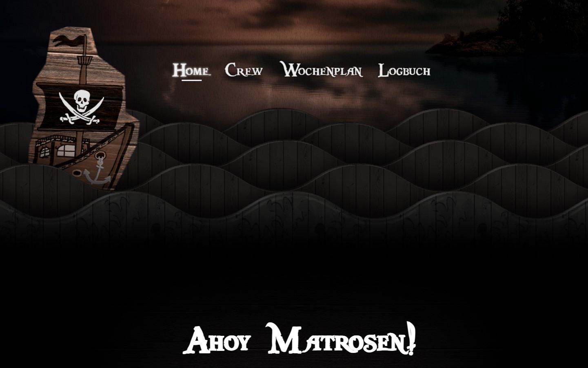

[](https://pirates-ophase.de)

# pirates-ophase.de 🏴‍☠️

Yohoho!
This repository contains the source code for the
[Pirates website](https://pirates-ophase.de/).
The website's main purpose is to inform freshmen about our student group and
what we're doing with them in the o-week.

## Tooling
This website is built with [Next.js](https://nextjs.org/) (on top of
[React](https://reactjs.org/)) and compiles to a bunch of HTML, JS, etc. files
that are statically hosted on [GitHub Pages](https://pages.github.com/).

We aim to use modern but stable tooling to simplify maintainability.
Tools should be updated regularly but use stable / LTS releases if available.

The website is built and tested with
* [Node.js 16](https://nodejs.org/) for compilation
* [pnpm 7](https://pnpm.io/) for package management
* [lots and lots of JS packages](./package.json)

## Development setup
Make sure [node 16](https://nodejs.org/) and
[pnpm 7](https://pnpm.io/installation) are installed.

First, install all dependencies using
```sh
pnpm install
```

You can start a local development server (with live preview etc.) with
```sh
pnpm dev
```

Before committing, please make sure that the site can be built using
```sh
pnpm build
```

## Further resources
* Although most of the content is new or has been revised, much of the content
  (especially images!) have been copied from
  [the old Jekyll-based site](https://github.com/pirates-ophase/old-website) 
* The visual style of our website is heavily inspired by the amazingly beautiful
  [demo site](https://matthew.wagerfield.com/parallax/) from parallax JS.
  Some of our assets were also copied from there

## Deployment
The `main` branch is automatically deployed to our production website, see
[`.github/workflows/deploy-main.yml`](.github/workflows/deploy-main.yml) for
further details.

The `develop` branch is automatically deployed to
[pirates.maxschweik.art](https://pirates.maxschweik.art), see
[`.github/workflows/deploy-develop.yml`](.github/workflows/deploy-develop.yml) for
further details.
